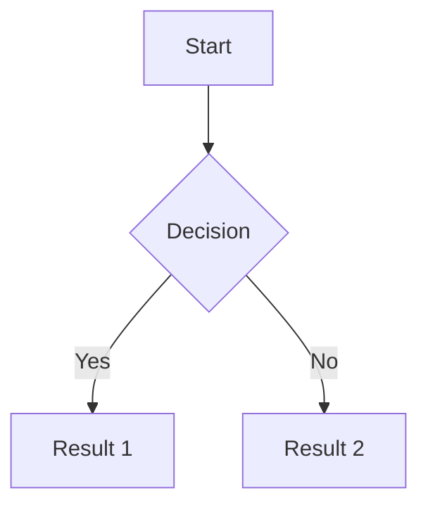

# Docs Quarts de Docs

**Docs Quarts de Docs** is the playful name of this teaching template.  
In Catalan, time is often expressed in “quarters” relative to the next hour:

- *un quart de dos* → 1:15 (literally, “a quarter of the way to two”)  
- *dos quarts de dos* → 1:30 (“two quarters of the way to two”)  
- *tres quarts de dos* → 1:45 (“three quarters of the way to two”)  

So *quarts de docs* sounds like *“quarts de dos”* (1:15, 1:30, 1:45…), the time of day when many students are already thinking about lunch. At the same time, it plays with the idea of *docs* as “documents” or “notes”.

The goal of this project is to provide students with a clear, accessible reference document — essentially structured lecture notes — in one or several formats. The idea is to enrich the project over time with more features and resources.

---

## Educational Manual with Jekyll GitBook

This repository provides a template for creating **educational materials** in the form of a **multilingual web book**.  
It is based on the original [jekyll-gitbook](https://github.com/sighingnow/jekyll-gitbook) theme, with important adaptations for teaching:

- Multilingual chapters (`ca`, `es`, `en`) with clean URLs.  
- Bibliographies and citations managed with [jekyll-scholar](https://github.com/inukshuk/jekyll-scholar) from BibTeX files.  
- Integration of slides (Reveal.js), diagrams (Mermaid), and advanced Markdown features.  
- Easy local testing with Docker + Makefile.  
- Ready-to-deploy with GitHub Pages.

This way, course materials are not static PDFs hidden in a folder, but a living, extensible resource that can evolve together with the course and its students.

---

## Table of Contents

- [Docs Quarts de Docs](#docs-quarts-de-docs)
  - [Educational Manual with Jekyll GitBook](#educational-manual-with-jekyll-gitbook)
  - [Table of Contents](#table-of-contents)
  - [Features](#features)
  - [Project Structure](#project-structure)
  - [Setup and Usage](#setup-and-usage)
    - [Prerequisites](#prerequisites)
    - [Build and Preview Locally](#build-and-preview-locally)
    - [Deploy with GitHub Pages](#deploy-with-github-pages)
  - [Writing Content](#writing-content)
    - [Chapters](#chapters)
    - [Bibliography and Citations](#bibliography-and-citations)
    - [Markdown and Extensions](#markdown-and-extensions)
  - [Makefile Shortcuts](#makefile-shortcuts)
  - [Markdown Reference](#markdown-reference)
    - [Headings](#headings)
    - [Bold and Italics](#bold-and-italics)
    - [Lists](#lists)
    - [Links](#links)
    - [Images](#images)
    - [Tables](#tables)
    - [Alert Blocks](#alert-blocks)
    - [MathJax and LaTeX](#mathjax-and-latex)
    - [Footnotes](#footnotes)
    - [Syntax Highlighting](#syntax-highlighting)
    - [Mermaid Diagrams](#mermaid-diagrams)
  - [License](#license)
  - [Acknowledgements](#acknowledgements)

---

## Features

- **GitBook-style layout**: Clean and responsive book interface.
- **Multilingual support**: Chapters can be written in multiple languages with language-aware permalinks.
- **Bibliography integration**: Cite references directly from BibTeX files using `jekyll-scholar`.
- **Slides and diagrams**: Reveal.js slides and Mermaid diagrams integrated into chapters.
- **Advanced Markdown**: Alerts, MathJax, footnotes, syntax highlighting, tables, and more.
- **Docker-ready**: Reproducible builds with Docker and a `Makefile`.

---

## Project Structure

```
.
├── _chapters/        # Chapters organized by language
├── _bibliography/    # BibTeX files for references
├── _pages/           # Additional static pages
├── _data/            # Language definitions and other config
├── assets/           # Images, icons, css, js
├── contrib/          # Docker and utility scripts
├── Makefile          # Build and deploy shortcuts
└── _config.yml       # Jekyll configuration
```

---

## Setup and Usage

### Prerequisites

- **Ubuntu 24.04 LTS** or equivalent (tested environment)
- [Docker](https://docs.docker.com/get-docker/) and [Docker Compose](https://docs.docker.com/compose/)
- `make` (for convenience with the provided Makefile)

### Build and Preview Locally

```bash
make 2-start-server
```

This command runs Jekyll inside Docker and serves the book at: [http://localhost:4000](http://localhost:4000)

To stop the server:

```bash
make 3-stop-server
```

### Deploy with GitHub Pages

The site is designed to be deployed automatically via **GitHub Actions**.
Every push to the `main` branch triggers a build and updates the GitHub Pages site.

---

## Writing Content

### Chapters

- Create new chapters inside `_chapters/<lang>/` (for example `_chapters/ca/01-introduction.md`).
- Each chapter begins with YAML metadata (`front matter`), e.g.:

```yaml
---
lang: en
permalink: /:title/en/
title: Introduction
author: Your Name
date: 2025-01-01
weight: 1
layout: chapter
mermaid: false
---
```

### Bibliography and Citations

- Place your references in `_bibliography/references.bib`.
- Cite them in Markdown with ``.
- Insert a bibliography list with ``.

### Markdown and Extensions

This template supports extended Markdown:

- **Alert blocks** (tip, warning, danger).
- **MathJax** for LaTeX formulas.
- **Footnotes** (`[^1]` syntax).
- **Syntax highlighting** for code blocks.
- **Mermaid diagrams** (requires `mermaid: true` in the front matter).

See [Markdown Reference](#markdown-reference) for concrete examples.

---

## Makefile Shortcuts

Common commands are wrapped in a `Makefile`:

- `make 2-start-server` → Start local Jekyll server (Docker).
- `make 3-stop-server` → Stop server and clean build.
- `make 4-push-source` → Push source branch.
- `make 5-deploy-website` → Deploy static site (if using branch deploy).

---

## Markdown Reference

The content of this manual is written in Markdown, with several useful extensions.

### Headings
Use the hash symbol (`#`) followed by a space to create headings of different levels.  
- `#` → main title  
- `##` → subtitle  
- and so on.

### Bold and Italics
- Use **double asterisks** for bold text.  
- Use *single asterisks* for italics.  

### Lists
- Unordered lists use hyphens (`-`) or asterisks (`*`).  
- Ordered lists use numbers (`1.`, `2.`, etc.).  

### Links
```markdown
[Link text](URL)
```

### Images
```markdown

```

### Tables
Use `|` for columns and `-` for the header separator.  
Wrap in `<div class="table-wrapper">` for wide tables.

### Alert Blocks

```markdown
> ##### TIP
>
> This is a tip for the reader.
{: .block-tip }

> ##### WARNING
>
> This is a warning.
{: .block-warning }

> ##### DANGER
>
> This is a critical alert.
{: .block-danger }
```

### MathJax and LaTeX
- Inline: `$x^2 + y^2 = z^2$`  
- Display block:
```markdown
$$
x^2 + y^2 = z^2
$$
```

### Footnotes
```markdown
Here is a statement with a footnote.[^1]

[^1]: This is the footnote text.
```

### Syntax Highlighting
```python
def hello_world():
    print("Hello, world!")
```

### Mermaid Diagrams
Enable per file with `mermaid: true` in front matter:

```markdown

```

---

## License

This project is licensed under the MIT License. See the [LICENSE](LICENSE) file.

---

## Acknowledgements

- [jekyll-gitbook](https://github.com/sighingnow/jekyll-gitbook) by [Sighingnow](https://github.com/sighingnow)  
- [jekyll-scholar](https://github.com/inukshuk/jekyll-scholar) by [Inukshuk](https://github.com/inukshuk)  

We extend their work to support multilingual educational materials, academic citations, and teaching resources.