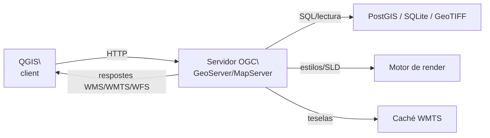
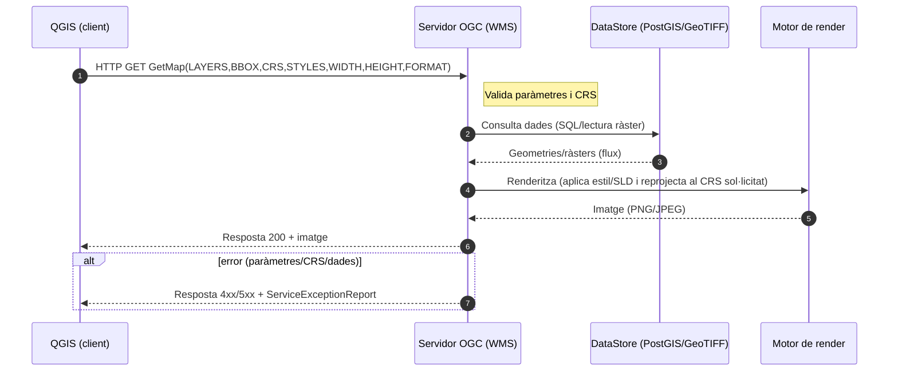
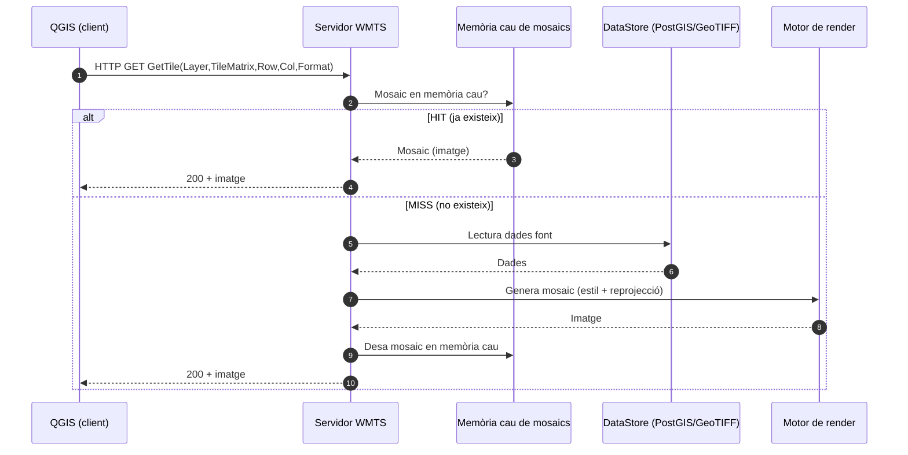
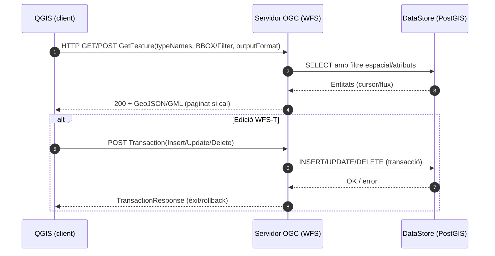

La informació geogràfica no existeix en el buit. Tota representació cartogràfica necessita un **context geogràfic** que permeta a l’usuari orientar-se i comprendre la informació que es presenta. A l’era digital, aquest context el proporcionen els **serveis web geogràfics**, una primera i molt eficaç manera de carregar dades en els nostres projectes SIG sense necessitat de descarregar arxius localment.

Aquest capítol explora com funcionen aquests serveis, els estàndards que els regeixen i com integrar-los en els nostres projectes. Començarem amb eines d’abast mundial i després ens centrarem en els recursos específics de Catalunya, que seran la nostra referència principal durant el curs.

## L’ecosistema de serveis web geogràfics

### De dades locals a serveis distribuïts

Durant dècades, treballar amb informació geogràfica implicava gestionar arxius locals: descarregar shapefiles, bases de dades, imatges ràster i emmagatzemar-les als nostres discos durs. Aquest model tenia limitacions evidents: les dades es desactualitzaven ràpidament, ocupaven molt d’espai d’emmagatzematge i era complex combinar informació de diferents fonts.

Els **serveis web geogràfics** han transformat radicalment aquest panorama. Permeten accedir a dades actualitzades en temps real, combinar informació de múltiples proveïdors i treballar amb volums de dades que seria impracticable gestionar localment. En lloc de “posseir” les dades, les “consultem” segons les nostres necessitats específiques.

### El paper de l’Open Geospatial Consortium (OGC)

La interoperabilitat entre diferents sistemes i proveïdors és possible gràcies al treball de l’**[Open Geospatial Consortium (OGC)](https://www.ogc.org/)**, una organització internacional que desenvolupa estàndards oberts per a l’intercanvi d’informació geoespacial. Fundat el 1994, l’OGC agrupa més de 500 organitzacions d’arreu del món i ha definit els protocols que permeten que un client com QGIS puga consumir dades de servidors tan diversos com l’Institut Geogràfic Nacional d’Espanya, la NASA o l’Institut Cartogràfic i Geològic de Catalunya.

Els estàndards més rellevants per al nostre treball són **WMS** (Web Map Service) per a imatges de mapes, **WMTS** (Web Map Tile Service) per a mapes en mosaic precomputats i **WFS** (Web Feature Service) per a dades vectorials amb capacitat de consulta. Tots funcionen mitjançant peticions HTTP estàndard, la qual cosa garanteix la seua compatibilitat universal.

## Arquitectura i funcionament dels serveis web

L’arquitectura dels serveis web geogràfics segueix un model **client-servidor** on QGIS actua com a client que formula peticions HTTP a servidors remots. El servidor processa la petició, accedeix a les seues bases de dades geogràfiques, aplica la cartografia i simbologia configurada, i retorna el resultat en un format estàndard.

L’esquema següent resumeix els actors principals: QGIS com a client, el servidor OGC (com GeoServer o MapServer), la base de dades geoespacial (PostGIS, SQLite o fitxers ràster), el motor de render (encarregat d’aplicar estils i generar imatges), i opcionalment la memòria cau de mosaics (per a WMTS). Les fletxes mostren les direccions de comunicació: QGIS envia peticions HTTP, el servidor accedeix a dades i renderitza, i després respon al client amb imatges o dades vectorials.



És important assenyalar que els **serveis web OGC es poden connectar directament des de QGIS**. Només cal obrir el panell d’**Administrador de fonts de dades** (`Capa > Afig capa > Afig capa WMS/WMTS` o `Afig capa WFS`), introduir la URL del servei proporcionada per l’organisme corresponent i assignar-li un nom de connexió. Una vegada configurada, la connexió queda guardada a QGIS i pot reutilitzar-se en qualsevol projecte.

Per exemple, el **Cadastre d’Espanya** ofereix un servei WMS oficial accessible des de:

```bash
https://ovc.catastro.meh.es/Cartografia/WMS/ServidorWMS.aspx
```

Si afegim aquesta URL com a connexió WMS a QGIS, podrem visualitzar directament la cartografia cadastral sense necessitat de descarregar arxius.

{: style="display:block; margin-left:auto; margin-right:auto; width:30%;" }

Aquest procediment permet un control directe i transparent sobre els serveis als quals accedim, però requereix conéixer i gestionar manualment les URLs. Per simplificar aquesta tasca, existeixen **connectors que reuneixen llistats organitzats de recursos**, com QuickMapServices o el connector de l’ICGC, que faciliten la incorporació de capes de múltiples proveïdors sense necessitat de configurar cada connexió de manera manual.

### WMS - Web Map Service (GetMap)

En aquest flux, QGIS envia una petició GetMap al servidor OGC indicant capes, extensió geogràfica, sistema de referència i format d’eixida. El servidor consulta la base de dades geogràfica (per exemple, PostGIS o ràsters), obté les geometries o cel·les rellevants i les passa al motor de render. Allí s’apliquen estils (SLD), es reprojecten les dades al CRS sol·licitat i es genera la imatge final (PNG o JPEG). Aquesta imatge es retorna al client com una resposta HTTP. Si hi ha algun error en els paràmetres (CRS no suportat, capa inexistent…), el servidor respon amb un *ServiceExceptionReport*.



### WMTS - Web Map Tile Service (GetTile)

El flux de WMTS es basa en mosaics precalculats o guardats en memòria cau. Quan QGIS demana un mosaic específic (identificat per TileMatrix, Row, Col), el servidor primer consulta la memòria cau. Si el mosaic ja existeix (*cache hit*), es retorna de seguida al client. Si no hi és (*cache miss*), el servidor genera el mosaic a partir de les dades de la base (consultant PostGIS o arxius ràster), el processa amb el motor de render, el guarda a la memòria cau i finalment el retorna al client. Aquest model redueix la càrrega de càlcul i millora el rendiment en visors interactius.



### WFS - Web Feature Service (GetFeature i WFS-T)

En aquest cas, QGIS demana entitats vectorials amb una petició `GetFeature`, incloent-hi filtres espacials o atributs. El servidor executa una consulta SQL sobre la base de dades (per exemple, PostGIS) i retorna les entitats en format GML o GeoJSON. Si s’utilitza l’extensió WFS-T (*Transactional*), el client també pot enviar canvis (Insert, Update, Delete). El servidor tradueix aquestes operacions en transaccions SQL sobre la base de dades i respon amb un informe d’èxit o *rollback* si hi ha errors.



### Principals diferències entre serveis OGC

| Servei | Què retorna | Quan usar-lo | Avantatges | Limitacions |
|--------|-------------|--------------|------------|-------------|
| **WMS** | Imatges de mapes generades sota demanda | Mapes temàtics amb simbologia complexa, dades que canvien sovint | Flexibilitat total, sempre actualitzat | Latència alta, depèn de la connexió |
| **WMTS** | Mosaics de mapa precomputats | Mapes base, visualització ràpida, molts usuaris alhora | Rendiment excel·lent, memòria cau | Només escales predefinides, actualització complexa |
| **WFS** | Dades vectorials (geometries + atributs) | Anàlisi espacial, consultes, edició | Accés a dades reals, interactivitat | Volum de transferència alt |

Aquesta diferència és crucial per decidir quin servei utilitzar en cada situació. Per a mapes de context general privilegiarem WMTS per la seua rapidesa; per a anàlisis detallats preferirem WFS, que ens done accés a les dades originals.

## QuickMapServices: serveis web globals

**[QuickMapServices (QMS)](https://plugins.qgis.org/plugins/quick_map_services/)** és el connector més utilitzat per accedir ràpidament a serveis de mapes base d’arreu del món. Desenvolupat per NextGIS, simplifica enormement el procés d’afegir serveis com OpenStreetMap, Google Maps o imatges satel·litals.

La instal·lació és directa des del gestor de connectors de QGIS. Una vegada instal·lat, és imprescindible activar el **paquet de contribucions** des de `Web > QuickMapServices > Settings > More services > Get contributed pack`. Això descarrega definicions de serveis addicionals mantingudes per la comunitat internacional.

QMS organitza els serveis per categories temàtiques. **OpenStreetMap** ofereix diferents estils de la cartografia col·laborativa més completa del món, des de l’estil estàndard fins a versions especialitzades en transport o elements humanitaris. Els serveis d’**imatges satel·litals** inclouen Google Satellite i Bing, útils per a contextualització visual encara que condicionats pels seus termes d’ús comercial. **CartoDB** i **Stamen** proporcionen estils cartogràfics minimalistes ideals per a visualització de dades temàtiques.


## Serveis web de l'Institut Cartogràfic i Geològic de Catalunya (ICGC)

Els serveis globals són excel·lents per a contextualització general, comparació entre regions i treball en àrees on no disposem de cartografia local detallada. Tanmateix, per a anàlisis professionals a Catalunya i Espanya, els serveis oficials locals ofereixen més precisió, actualització i riquesa temàtica. Aquesta és la raó per la qual, després de familiaritzar-nos amb QMS, centrarem la nostra atenció en els serveis de l’ICGC.

L’**[Institut Cartogràfic i Geològic de Catalunya (ICGC)](https://www.icgc.cat/)** és la nostra referència principal per a aquest curs. Creat el 2014 però amb antecedents que es remunten a l’Institut Cartogràfic de Catalunya de 1982, l’ICGC és pioner a Espanya en el desenvolupament de serveis geogràfics avançats i referent internacional en cartografia oficial i geologia.

L’ICGC no és només un proveïdor més de serveis cartogràfics. És un exemple de com una institució pública pot liderar la innovació en informació geogràfica. Els seus serveis web són tècnicament excel·lents, estan perfectament documentats, s’actualitzen regularment i, molt important, són completament **gratuïts i oberts** per a ús públic. A més, ha desenvolupat eines específiques per a QGIS que faciliten enormement el treball amb les seues dades.

La qualitat tècnica dels productes de l’ICGC és reconeguda internacionalment. Les seues ortofotografies tenen resolucions de fins a 25 cm/píxel, la seua cartografia topogràfica s’actualitza contínuament mitjançant fotogrametria i treball de camp, i les seues dades LiDAR arriben a densitats de 10 punts/m². Per a qualsevol treball en territori català, les dades de l’ICGC són simplement insuperables.

### El connector de l’ICGC: més enllà dels serveis estàndard

El **[connector de l’ICGC per a QGIS](https://plugins.qgis.org/plugins/QgisPlugin/)** va molt més enllà de ser un simple accés a serveis web. És una suite completa d’eines geogràfiques desenvolupada específicament per optimitzar el treball amb dades catalanes.

El connector organitza els serveis en categories lògiques: **Cartografia topogràfica** amb escales des d’1:1.000 fins a 1:250.000, **Ortofotografies** actuals i històriques que permeten anàlisis d’evolució territorial, **Imatges satel·litals** processades de Sentinel i Landsat, **Geologia** amb cartografia detallada i informació sobre recursos i riscos, i **Models digitals d’elevació** d’alta precisió derivats de dades LiDAR.

Però la vertadera potència del connector resideix en les seues **eines integrades**. La cerca geogràfica per topònims catalans és immediata i precisa. Les eines d’anàlisi inclouen generació de perfils topogràfics, càlcul de conques visuals, descàrrega de dades per a treball offline, i accés directe a més de 200 capes temàtiques sense necessitat de configurar manualment les connexions.


### Serveis web de l’ICGC

Els serveis web de l’ICGC segueixen estrictament els estàndards OGC i estan optimitzats per a rendiment. Els seus servidors WMS i WMTS estan distribuïts geogràficament i utilitzen sistemes de memòria cau avançats que garanteixen temps de resposta excel·lents fins i tot en hores de molta demanda.

La **cartografia topogràfica** de l’ICGC s’actualitza contínuament. A diferència d’altres organismes que treballen amb cicles d’actualització de diversos anys, l’ICGC utilitza una metodologia d’**actualització contínua** que combina fotogrametria aèria, dades de sensors remots i treball de camp sistemàtic. Això significa que elements com noves urbanitzacions, infraestructures o canvis en la xarxa viària apareixen en els mapes oficials en qüestió de mesos.

Les **ortofotografies** de l’ICGC inclouen sèries històriques que es remunten a 1945, una eina valuosa per a estudis d’evolució territorial i anàlisis diacròniques. La resolució estàndard és de 25 cm/píxel per a les imatges més recents, però en àrees urbanes pot arribar fins a 10 cm/píxel.

## Integració pràctica: explorant el context geogràfic

### Estratègia de treball amb múltiples serveis

La clau del treball professional amb serveis web és utilitzar el **servei apropiat per a cada fase** del projecte. Per a contextualització inicial i orientació general, els serveis globals de QMS són ideals. Per a anàlisi detallada i treball professional a Catalunya, el connector de l’ICGC és insubstituïble. Per a estudis que requereixen dades de tota Espanya, els serveis de l’IGN proporcionen cobertura nacional homogènia.

Aquesta aproximació per capes permet optimitzar tant el rendiment com la qualitat dels resultats. Comencem amb una visió general del territori utilitzant OpenStreetMap o Google Satellite, refinem amb ortofotografies de l’ICGC per identificar detalls específics, i afegim informació temàtica especialitzada segons les necessitats del projecte.

### Consideracions tècniques i de rendiment

Els serveis web estan optimitzats per a visualització, no necessàriament per a anàlisis intensius. Per a consultes puntuals, anàlisis visuals i contextualització són perfectes. No obstant això, si el nostre treball requereix anàlisi espacial complexa, geoprocessament intensiu o treball offline, serà més eficient descarregar les dades localment. Aquesta decisió entre “*streaming*” i “descàrrega” l’explorarem en detall en capítols següents.

És important també considerar les **projeccions cartogràfiques**. Els serveis web solen treballar en Web Mercator (EPSG:3857) per compatibilitat, però per a treball professional a Catalunya és preferible configurar els projectes en ETRS89 UTM 31N (EPSG:25831) i deixar que QGIS faça la reprojecció automàtica. Això s’entendrà millor en el capítol sobre sistemes de referència.

## Pràctica

1. **Instal·lació i configuració d’eines.** Instal·la QuickMapServices des del gestor de connectors de QGIS i activa el paquet de contribucions per accedir a serveis addicionals. A continuació, instal·la el connector de l’ICGC cercant “Institut Cartogràfic i Geològic de Catalunya” en el repositori oficial. Reinicia QGIS perquè s’activen completament ambdós connectors.
2. **Comparació de serveis per a contextualització** Crea un nou projecte centrat en una zona de Catalunya que conegues bé. Afig successivament OpenStreetMap Standard des de QMS, Google Satellite si està disponible, i l’ortofotografia de l’ICGC des del seu connector. Observa les diferències en nivell de detall, actualització i qualitat cartogràfica. Quin resulta més útil per identificar elements urbans? I per analitzar el territori rural?
3. **Construcció d’un context geogràfic multicapa.** Utilitzant el connector de l’ICGC, construeix un context geogràfic que combine ortofotografia actual com a base, límits municipals, xarxa hidrogràfica i corbes de nivell. Experimenta amb la transparència de les capes per crear una composició equilibrada que proporcione context sense saturar visualment el mapa.
4. **Anàlisi de sèries temporals amb ortofotografies històriques.** Una de les grans avantatges de l’ICGC és la seua col·lecció d’ortofotografies històriques. Selecciona una zona que haja experimentat transformacions urbanes significatives i compara ortofotografies de diferents dècades. Documenta els canvis observats: quins elements han aparegut o desaparegut? Com ha evolucionat l’ús del sòl?
