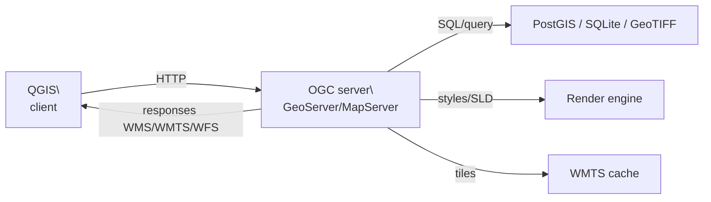
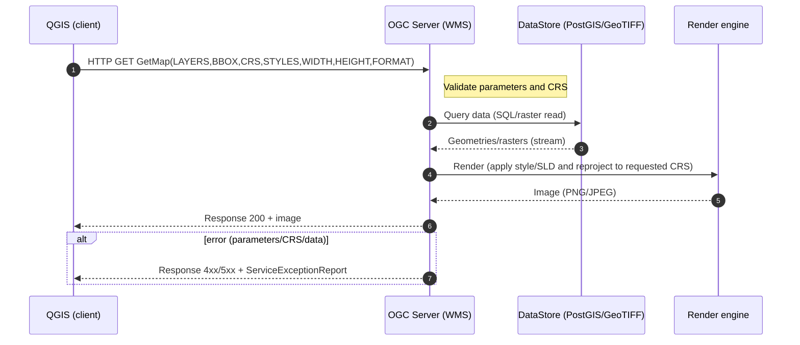
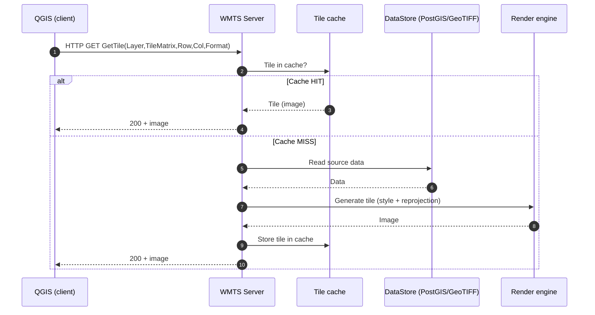
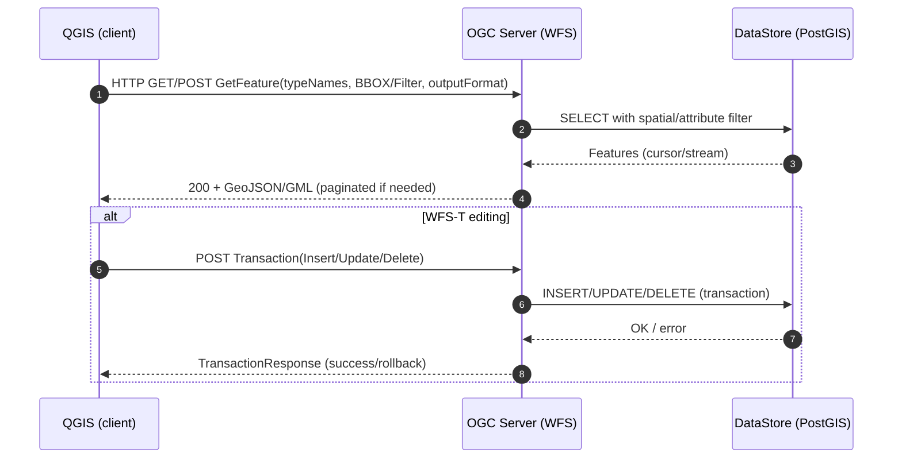

Geographic information does not exist in a vacuum. Every cartographic representation needs a **geographic context** that allows the user to orient themselves and understand the information being presented. In the digital era, this context is provided by **web map services**, a first and very effective way of loading data into our GIS projects without having to download files locally.

This chapter explores how these services work, the standards that govern them, and how to integrate them into our projects. We will start with tools of global scope and then focus on resources specific to Catalonia, which will be our main reference during the course.

## The ecosystem of web map services

### From local data to distributed services

For decades, working with geographic information meant managing local files: downloading shapefiles, databases, raster images, and storing them on our hard drives. This model had obvious limitations: data quickly became outdated, required large amounts of storage space, and it was difficult to combine information from different sources.

**Web map services** have radically transformed this landscape. They allow access to up-to-date data in real time, the ability to combine information from multiple providers, and the possibility of working with volumes of data that would be impractical to manage locally. Instead of “owning” the data, we “query” it according to our specific needs.

### The role of the Open Geospatial Consortium (OGC)

Interoperability between different systems and providers is made possible by the work of the **[Open Geospatial Consortium (OGC)](https://www.ogc.org/)**, an international organization that develops open standards for the exchange of geospatial information. Founded in 1994, the OGC brings together more than 500 organizations worldwide and has defined the protocols that enable a client such as QGIS to consume data from servers as diverse as Spain’s National Geographic Institute, NASA, or the Institut Cartogràfic i Geològic de Catalunya.

The most relevant standards for our work are **WMS** (Web Map Service) for map images, **WMTS** (Web Map Tile Service) for precomputed tiled maps, and **WFS** (Web Feature Service) for vector data with query capabilities. All operate through standard HTTP requests, ensuring universal compatibility.

## Architecture and functioning of web services

The architecture of web map services follows a **client–server** model in which QGIS acts as the client making HTTP requests to remote servers. The server processes the request, accesses its geospatial databases, applies cartography and configured symbology, and returns the result in a standard format.

The following diagram summarizes the main actors: QGIS as client, the OGC server (such as GeoServer or MapServer), the geospatial database (PostGIS, SQLite, or raster files), the render engine (responsible for applying styles and generating images), and optionally the tile cache (for WMTS). The arrows show the directions of communication: QGIS sends HTTP requests, the server accesses data and renders it, and then responds to the client with images or vector data.



It is important to note that **OGC web services can be connected directly from QGIS**. Simply open the **Data Source Manager** panel (`Layer > Add Layer > Add WMS/WMTS Layer` or `Add WFS Layer`), enter the service URL provided by the corresponding organization, and assign it a connection name. Once configured, the connection is stored in QGIS and can be reused in any project.

For example, the **Spanish Cadastre** provides an official WMS service accessible at:

```bash
https://ovc.catastro.meh.es/Cartografia/WMS/ServidorWMS.aspx
```

If we add this URL as a WMS connection in QGIS, we can directly visualize the cadastral map without downloading any files.

{: style="display:block; margin-left:auto; margin-right:auto; width:30%;" }

This procedure allows direct and transparent control over the services we access, but requires knowing and manually managing URLs. To simplify this task, there are plugins that provide organized lists of resources, such as QuickMapServices or the ICGC plugin, which make it easier to add layers from multiple providers without having to configure each connection manually.

### WMS - Web Map Service (GetMap)

In this workflow, QGIS sends a GetMap request to the OGC server specifying layers, geographic extent, reference system, and output format. The server queries the geospatial database (for example, PostGIS or rasters), retrieves the relevant geometries or cells, and passes them to the render engine. There, styles (SLD) are applied, the data are reprojected into the requested CRS, and the final image (PNG or JPEG) is generated. This image is then returned to the client as an HTTP response. If there is any error in the parameters (unsupported CRS, missing layer, etc.), the server responds with a ServiceExceptionReport.



### WMTS - Web Map Tile Service (GetTile)

The WMTS workflow is based on precomputed or cached tiles. When QGIS requests a specific tile (identified by TileMatrix, Row, Col), the server first checks the cache. If the tile already exists (*cache hit*), it is immediately returned to the client. If it does not exist (*cache miss*), the server generates the tile from the underlying data (querying PostGIS or raster files), processes it with the render engine, stores it in the cache, and finally returns it to the client. This model reduces computational load and improves performance in interactive map viewers.



### WFS - Web Feature Service (GetFeature and WFS-T)

In this case, QGIS requests vector features with a `GetFeature` request, including spatial or attribute filters. The server executes an SQL query on the database (for example, PostGIS) and returns the features in GML or GeoJSON format. If the WFS-T (*Transactional*) extension is used, the client can also send changes (Insert, Update, Delete). The server translates these operations into SQL transactions on the database and responds with a success report or a rollback if errors occur.



### Main differences between OGC services

| Service | What it returns | When to use | Advantages | Limitations |
|---------|-----------------|-------------|------------|-------------|
| **WMS** | Map images generated on demand | Thematic maps with complex symbology, frequently changing data | Full flexibility, always up to date | High latency, depends on connection |
| **WMTS** | Precomputed map tiles | Basemaps, fast visualization, many users at once | Excellent performance, cacheable | Only predefined scales, complex updating |
| **WFS** | Vector data (geometries + attributes) | Spatial analysis, queries, editing | Access to raw data, interactivity | High transfer volume |

This difference is crucial when deciding which service to use in each situation. For general context maps, we will prioritize WMTS for its speed; for detailed analyses we will prefer WFS, which gives us access to the original data.

## QuickMapServices: global web services

**[QuickMapServices (QMS)](https://plugins.qgis.org/plugins/quick_map_services/)** is the most widely used plugin to quickly access basemap services worldwide. Developed by NextGIS, it greatly simplifies the process of adding services such as OpenStreetMap, Google Maps, or satellite imagery.

Installation is straightforward from the QGIS plugin manager. Once installed, it is essential to enable the **contributed pack** from `Web > QuickMapServices > Settings > More services > Get contributed pack`. This downloads additional service definitions maintained by the international community.

QMS organizes services into thematic categories. **OpenStreetMap** offers different styles of the world’s most complete collaborative map, from the standard style to specialized versions for transport or humanitarian purposes. **Satellite imagery** services include Google Satellite and Bing, useful for visual context although subject to their commercial terms of use. **CartoDB** and **Stamen** provide minimalist cartographic styles ideal for thematic data visualization.


## Institut Cartogràfic i Geològic de Catalunya (ICGC): web services available

Global services are excellent for general context, regional comparison, and work in areas without detailed local cartography. However, for professional analysis in Catalonia and Spain, official local services offer greater precision, more frequent updates, and richer thematic coverage. This is why, after familiarizing ourselves with QMS, we will focus on the services of the ICGC.

The **[Institut Cartogràfic i Geològic de Catalunya (ICGC)](https://www.icgc.cat/)** is our main reference for this course. Created in 2014 but with origins going back to the Institut Cartogràfic de Catalunya (1982), the ICGC is a pioneer in Spain in the development of advanced geographic services and an international reference in official cartography and geology.

The ICGC is not just another provider of cartographic services. It is an example of how a public institution can lead innovation in geographic information. Its web services are technically excellent, thoroughly documented, regularly updated and, importantly, completely **free and open** for public use. Moreover, it has developed specific tools for QGIS that make working with its data much easier.

The technical quality of the ICGC’s products is internationally recognized. Its orthophotos have resolutions up to 25 cm/pixel, its topographic maps are continuously updated through photogrammetry and fieldwork, and its LiDAR data reach densities of 10 points/m². For any work in Catalonia, ICGC data are simply unbeatable.

### The ICGC plugin: beyond standard services

The **[ICGC plugin for QGIS](https://plugins.qgis.org/plugins/QgisPlugin/)** goes far beyond simple access to web services. It is a complete suite of geographic tools specifically designed to optimize work with Catalan data.

The plugin organizes services into logical categories: **Topographic cartography** at scales from 1:1,000 to 1:250,000, **Orthophotos** (current and historical) for territorial evolution analysis, **Satellite imagery** processed from Sentinel and Landsat, **Geology** with detailed cartography and information on resources and risks, and **High-precision digital elevation models** derived from LiDAR data.

But the real power of the plugin lies in its **integrated tools**. Geographic search by Catalan place names is immediate and precise. Analysis tools include generation of topographic profiles, viewshed calculation, data download for offline work, and direct access to more than 200 thematic layers without manual configuration of connections.


### ICGC web services

ICGC web services strictly follow OGC standards and are optimized for performance. Its WMS and WMTS servers are geographically distributed and use advanced caching systems to guarantee excellent response times even during peak demand.

The **topographic cartography** of the ICGC is continuously updated. Unlike other agencies working with multi-year update cycles, the ICGC uses a methodology of **continuous updating** that combines aerial photogrammetry, remote sensing data, and systematic fieldwork. This means that features such as new developments, infrastructures, or changes in the road network appear in official maps within months.

The **orthophotos** of the ICGC include historical series dating back to 1945, an invaluable tool for studies of territorial evolution and diachronic analysis. The standard resolution is 25 cm/pixel for the most recent images, but in urban areas it can reach 10 cm/pixel.

## Practical integration: exploring the geographic context

### Strategy for working with multiple services

The key to professional work with web services is using the **appropriate service for each stage** of the project. For initial context and general orientation, QMS global services are ideal. For detailed analysis and professional work in Catalonia, the ICGC plugin is irreplaceable. For studies requiring nationwide data, IGN services provide homogeneous national coverage.

This layered approach allows us to optimize both performance and the quality of results. We start with a general view of the territory using OpenStreetMap or Google Satellite, refine with ICGC orthophotos to identify specific details, and add specialized thematic information according to project needs.

### Technical and performance considerations

Web services are optimized for visualization, not necessarily for intensive analysis. For quick queries, visual inspection, and context they are perfect. However, if our work requires complex spatial analysis, intensive geoprocessing, or offline work, it will be more efficient to download the data locally. This decision between “streaming” and “download” will be explored in detail in later chapters.

It is also important to consider **map projections**. Web services usually operate in Web Mercator (EPSG:3857) for compatibility, but for professional work in Catalonia it is preferable to configure projects in ETRS89 UTM 31N (EPSG:25831) and let QGIS handle on-the-fly reprojection. This will be better understood in the chapter on reference systems.

## Practice

1. **Installing and configuring tools.** Install QuickMapServices from the QGIS plugin manager and enable the contributed pack to access additional services. Then install the ICGC plugin by searching for “Institut Cartogràfic i Geològic de Catalunya” in the official repository. Restart QGIS so that both plugins are fully enabled.  
2. **Comparing services for context.** Create a new project focused on an area of Catalonia you know well. Add OpenStreetMap Standard from QMS, Google Satellite if available, and the ICGC orthophoto from its plugin. Observe the differences in level of detail, update frequency, and cartographic quality. Which is more useful for identifying urban features? And for analyzing rural areas?  
3. **Building a multilayer geographic context.** Using the ICGC plugin, build a geographic context that combines current orthophoto as a base, municipal boundaries, hydrographic network, and contour lines. Experiment with layer transparency to create a balanced composition that provides context without visually overloading the map.  
4. **Analysing temporal series with historical orthophotos.** One of the great advantages of the ICGC is its collection of historical orthophotos. Select an area that has undergone significant urban transformations and compare orthophotos from different decades. Document the observed changes: which elements have appeared or disappeared? How has land use evolved?  
