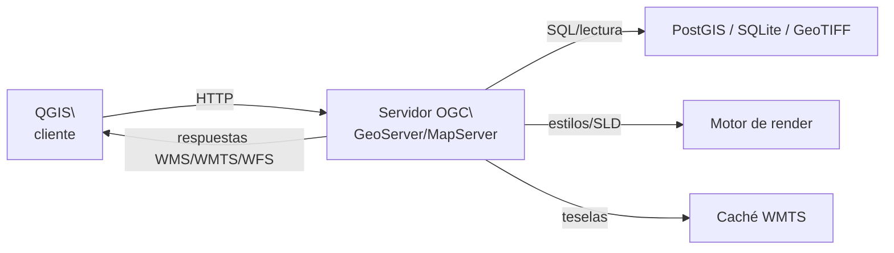
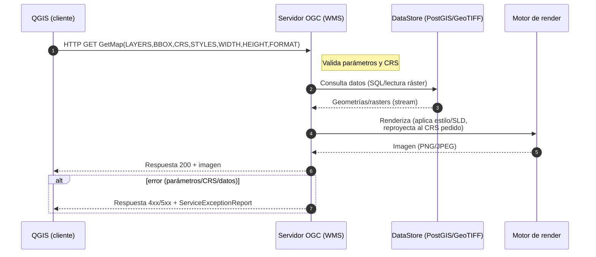
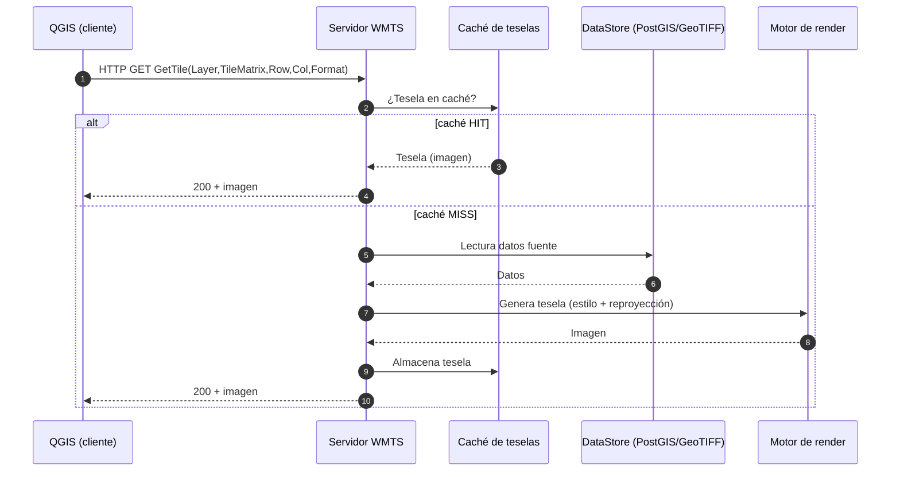
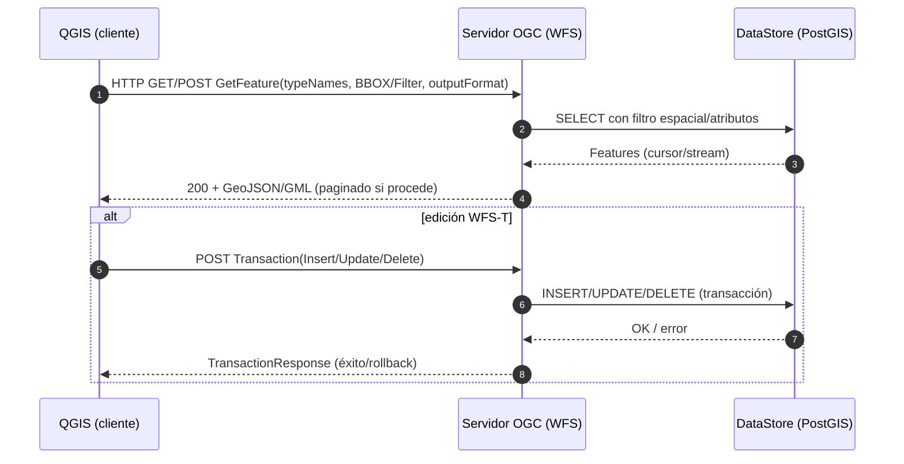

La información geográfica no existe en el vacío. Toda representación cartográfica necesita un **contexto geográfico** que permita al usuario orientarse y comprender la información que se presenta. En la era digital, este contexto lo proporcionan los **servicios web geográficos**, una primera y muy eficaz manera de cargar datos en nuestros proyectos SIG sin necesidad de descargar archivos localmente.

Este capítulo explora cómo funcionan estos servicios, los estándares que los rigen y cómo integrarlos en nuestros proyectos. Comenzaremos con herramientas de alcance mundial y después nos centraremos en los recursos específicos de Catalunya, que serán nuestra referencia principal durante el curso.

## El ecosistema de servicios web geográficos

### De datos locales a servicios distribuidos

Durante décadas, trabajar con información geográfica implicaba gestionar archivos locales: descargar shapefiles, bsses de datos, imágenes raster y almacenarlas en nuestros discos duros. Este modelo tenía limitaciones evidentes: los datos se desactualizaban rápidamente, ocupaban mucho espacio de almacenamiento y era complejo combinar información de diferentes fuentes.

Los **servicios web geográficos** han transformado radicalmente este panorama. Permiten acceder a datos actualizados en tiempo real, combinar información de múltiples proveedores y trabajar con volúmenes de datos que serían impracticables de gestionar localmente. En lugar de "poseer" los datos, los "consultamos" según nuestras necesidades específicas.

### El papel del Open Geospatial Consortium (OGC)

La interoperabilidad entre diferentes sistemas y proveedores es posible gracias al trabajo del **[Open Geospatial Consortium (OGC)](https://www.ogc.org/)**, una organización internacional que desarrolla estándares abiertos para el intercambio de información geoespacial. Fundado en 1994, el OGC agrupa más de 500 organizaciones de todo el mundo y ha definido los protocolos que permiten que un cliente como QGIS pueda consumir datos de servidores tan diversos como el Instituto Geográfico Nacional de España, NASA o el Institut Cartogràfic i Geològic de Catalunya.

Los estándares más relevantes para nuestro trabajo son **WMS** (Web Map Service) para imágenes de mapas, **WMTS** (Web Map Tile Service) para mapas en teselas precomputadas y **WFS** (Web Feature Service) para datos vectoriales con capacidad de consulta. Todos funcionan mediante peticiones HTTP estándar, lo que garantiza su compatibilidad universal.

## Arquitectura y funcionamiento de los servicios web

La arquitectura de los servicios web geográficos sigue un modelo **cliente-servidor** donde QGIS actúa como cliente que formula peticiones HTTP a servidores remotos. El servidor procesa la petición, accede a sus bases de datos geográficas, aplica la cartografía y simbología configurada, y devuelve el resultado en un formato estándar.

El siguiente esquema resume los actores principales: QGIS como cliente, el servidor OGC (como GeoServer o MapServer), la base de datos geoespacial (PostGIS, SQLite o ficheros ráster), el motor de render (encargado de aplicar estilos y generar imágenes), y opcionalmente la caché de teselas (para WMTS). Las flechas muestran las direcciones de comunicación: QGIS envía peticiones HTTP, el servidor accede a datos y renderiza, y luego responde al cliente con imágenes o datos vectoriales.



Es importante señalar que los **servicios web OGC se pueden conectar directamente desde QGIS**. Basta con abrir el panel de **Administrador de fuentes de datos** (`Capa > Añadir capa > Añadir capa WMS/WMTS` o `Añadir capa WFS`), introducir la URL del servicio proporcionada por el organismo correspondiente y asignarle un nombre de conexión. Una vez configurada, la conexión queda guardada en QGIS y puede reutilizarse en cualquier proyecto.

Por ejemplo, el **Catastro de España** ofrece un servicio WMS oficial accesible desde:

```bash
https://ovc.catastro.meh.es/Cartografia/WMS/ServidorWMS.aspx
```

Si añadimos esta URL como conexión WMS en QGIS, podremos visualizar directamente la cartografía catastral sin necesidad de descargar archivos.

{: style="display:block; margin-left:auto; margin-right:auto; width:30%;" }

Este procedimiento permite un control directo y transparente sobre los servicios a los que accedemos, pero requiere conocer y gestionar manualmente las URLs. Para simplificar esta tarea, existen **plugins que reúnen listados organizados de recursos**, como QuickMapServices o el plugin del ICGC, que facilitan la incorporación de capas de múltiples proveedores sin necesidad de configurar cada conexión de forma manual.

### WMS - Web Map Service (GetMap)

En este flujo, QGIS envía una petición GetMap al servidor OGC indicando capas, extensión geográfica, sistema de referencia y formato de salida. El servidor consulta la base de datos geográfica (por ejemplo, PostGIS o rásteres), obtiene las geometrías o celdas relevantes y las pasa al motor de render. Allí se aplican estilos (SLD), se reproyectan los datos al CRS solicitado y se genera la imagen final (PNG o JPEG). Esta imagen se devuelve al cliente como una respuesta HTTP. Si hay algún error en los parámetros (CRS no soportado, capa inexistente…), el servidor responde con un ServiceExceptionReport.



### WMTS - Web Map Tile Services (GetTile)

El flujo de WMTS se basa en teselas precalculadas o cacheadas. Cuando QGIS pide una tesela específica (identificada por TileMatrix, Row, Col), el servidor primero consulta la caché. Si la tesela ya existe (cache hit), se devuelve de inmediato al cliente. Si no está (cache miss), el servidor genera la tesela a partir de los datos de la base (consultando PostGIS o archivos ráster), la procesa con el motor de render, la guarda en la caché y finalmente la devuelve al cliente. Este modelo reduce la carga de cálculo y mejora el rendimiento en visores interactivos.



### WFS - Web Feature Service (GetFeature y WFS-T)

En este caso, QGIS pide entidades vectoriales con una petición `GetFeature`, incluyendo filtros espaciales o atributos. El servidor ejecuta una consulta SQL sobre la base de datos (por ejemplo, PostGIS) y devuelve las entidades en formato GML o GeoJSON. Si se usa la extensión WFS-T (Transactional), el cliente también puede enviar cambios (Insert, Update, Delete). El servidor traduce esas operaciones en transacciones SQL sobre la base de datos y responde con un informe de éxito o rollback si hubo errores.



### Principales diferencias entre servicios OGC

| Servicio | Qué devuelve | Cuándo usar | Ventajas | Limitaciones |
|----------|--------------|-------------|----------|--------------|
| **WMS** | Imágenes de mapas generadas bajo demanda | Mapas temáticos con simbología compleja, datos que cambian frecuentemente | Flexibilidad total, siempre actualizado | Latencia alta, depende de conexión |
| **WMTS** | Teselas de mapa precomputadas | Mapas base, visualización rápida, trabajo con muchos usuarios | Rendimiento excelente, cacheable | Solo escalas predefinidas, actualización compleja |
| **WFS** | Datos vectoriales (geometrías + atributos) | Análisis espacial, consultas, edición | Acceso a datos reales, interactividad | Volumen de transferencia alto |

Esta diferencia es crucial para decidir cuál usar en cada situación. Para mapas de contexto general privilegiaremos WMTS por su rapidez; para análisis detallados preferiremos WFS que nos dé acceso a los datos originales.

## QuickMapServices: servicios web globales

**[QuickMapServices (QMS)](https://plugins.qgis.org/plugins/quick_map_services/)** es el plugin más utilizado para acceder rápidamente a servicios de mapas base de todo el mundo. Desarrollado por NextGIS, simplifica enormemente el proceso de añadir servicios como OpenStreetMap, Google Maps o imágenes satelitales.

La instalación es directa desde el gestor de complementos de QGIS. Una vez instalado, es imprescindible activar el **paquete de contribuciones** desde `Web > QuickMapServices > Settings > More services > Get contributed pack`. Esto descarga definiciones de servicios adicionales mantenidas por la comunidad internacional.

QMS organiza los servicios por categorías temáticas. **OpenStreetMap** ofrece diferentes estilos de la cartografía colaborativa más completa del mundo, desde el estilo estándar hasta versiones especializadas en transporte o elementos humanitarios. Los servicios de **imágenes satelitales** incluyen Google Satellite y Bing, útiles para contextualización visual aunque condicionados por sus términos de uso comercial. **CartoDB** y **Stamen** proporcionan estilos cartográficos minimalistas ideales para visualización de datos temáticos.


## Serveis web de l'Institut Cartogràfic i Geològic de Catalunya (ICGC)

Los servicios globales son excelentes para contextualización general, comparación entre regiones y trabajo en áreas donde no disponemos de cartografía local detallada. Sin embargo, para análisis profesionales en Catalunya y España, los servicios oficiales locales ofrecen mayor precisión, actualización y riqueza temática. Esta es la razón por la cual, después de familiarizarnos con QMS, centraremos nuestra atención en los servicios del ICGC.

El **[Institut Cartogràfic i Geològic de Catalunya (ICGC)](https://www.icgc.cat/)** es nuestra referencia principal para este curso. Creado en 2014 pero con antecedentes que se remontan al Institut Cartogràfic de Catalunya de 1982, el ICGC es pionero en España en el desarrollo de servicios geográficos avanzados y referente internacional en cartografía oficial y geología.

El ICGC no es solo un proveedor más de servicios cartográficos. Es un ejemplo de cómo una institución pública puede liderar la innovación en información geográfica. Sus servicios web son técnicamente excelentes, están perfectamente documentados, se actualizan regularmente y, muy importante, son completamente **gratuitos y abiertos** para uso público. Además, ha desarrollado herramientas específicas para QGIS que facilitan enormemente el trabajo con sus datos.

La calidad técnica de los productos del ICGC es reconocida internacionalmente. Sus ortofotografías tienen resoluciones de hasta 25 cm/píxel, su cartografía topográfica se actualiza continuamente mediante fotogrametría y trabajo de campo, y sus datos LiDAR alcanzan densidades de 10 puntos/m². Para cualquier trabajo en territorio catalán, los datos del ICGC son simplemente insuperables.

### El plugin del ICGC: más allá de los servicios estándar

El **[plugin del ICGC para QGIS](https://plugins.qgis.org/plugins/QgisPlugin/)** va mucho más allá de ser un simple acceso a servicios web. Es una suite completa de herramientas geográficas desarrollada específicamente para optimizar el trabajo con datos catalanes.

El plugin organiza los servicios en categorías lógicas: **Cartografía topográfica** con escalas desde 1:1.000 hasta 1:250.000, **Ortofotografías** actuales e históricas que permiten análisis de evolución territorial, **Imágenes satelitales** procesadas de Sentinel y Landsat, **Geología** con cartografía detallada y información sobre recursos y riesgos, y **Modelos digitales de elevación** de alta precisión derivados de datos LiDAR.

Pero la verdadera potencia del plugin reside en sus **herramientas integradas**. La búsqueda geográfica por topónimos catalanes es inmediata y precisa. Las herramientas de análisis incluyen generación de perfiles topográficos, cálculo de cuencas visuales, descarga de datos para trabajo offline, y acceso directo a más de 200 capas temáticas sin necesidad de configurar manualmente las conexiones.


### Servicios web del ICGC

Los servicios web del ICGC siguen estrictamente los estándares OGC y están optimizados para rendimiento. Sus servidores WMS y WMTS están distribuidos geográficamente y utilizan sistemas de caché avanzados que garantizan tiempos de respuesta excelentes incluso en horas de alta demanda.

La **cartografía topográfica** del ICGC es actualizada continuamente. A diferencia de otros organismos que trabajan con ciclos de actualización de varios años, el ICGC utiliza una metodología de **actualización continua** que combina fotogrametría aérea, datos de sensores remotos y trabajo de campo sistemático. Esto significa que elementos como nuevas urbanizaciones, infraestructuras o cambios en la red viaria aparecen en los mapas oficiales en cuestión de meses.

Las **ortofotografías** del ICGC incluyen series históricas que se remontan a 1945, una herramienta invaluable para estudios de evolución territorial y análisis diacrónicos. La resolución estándar es de 25 cm/píxel para las imágenes más recientes, pero en áreas urbanas puede llegar hasta 10 cm/píxel.

## Integración práctica: explorando el contexto geográfico

### Estrategia de trabajo con múltiples servicios

La clave del trabajo profesional con servicios web reside en usar el **servicio apropiado para cada fase** del proyecto. Para contextualización inicial y orientación general, los servicios globales de QMS son ideales. Para análisis detallado y trabajo profesional en Catalunya, el plugin del ICGC es insustituible. Para estudios que requieran datos de toda España, los servicios del IGN proporcionan cobertura nacional homogénea.

Esta aproximación por capas permite optimizar tanto el rendimiento como la calidad de los resultados. Comenzamos con una visión general del territorio usando OpenStreetMap o Google Satellite, refinamos con ortofotografías del ICGC para identificar detalles específicos, y añadimos información temática especializada según las necesidades del proyecto.

### Consideraciones técnicas y de rendimiento

Los servicios web están optimizados para visualización, no necesariamente para análisis intensivos. Para consultas puntuales, análisis visuales y contextualización son perfectos. Sin embargo, si nuestro trabajo requiere análisis espacial complejo, geoprocesamiento intensivo o trabajo offline, será más eficiente descargar los datos localmente. Esta decisión entre "streaming" y "descarga" la exploraremos en detalle en próximos capítulos.

Es importante también considerar las **proyecciones cartográficas**. Los servicios web suelen trabajar en Web Mercator (EPSG:3857) por compatibilidad, pero para trabajo profesional en Catalunya es preferible configurar nuestros proyectos en ETRS89 UTM 31N (EPSG:25831) y dejar que QGIS haga la reproyección automática. Esto se entenderá mejor en el capítulo sobre sistemas de referencia.

## Práctica

1. **Instalación y configuración de herramientas.** Instala QuickMapServices desde el gestor de complementos de QGIS y activa el paquete de contribuciones para acceder a servicios adicionales. A continuación, instala el plugin del ICGC buscando “Institut Cartogràfic i Geològic de Catalunya” en el repositorio oficial. Reinicia QGIS para que ambos plugins queden completamente activados.  
2. **Comparación de servicios para contextualización.** Crea un nuevo proyecto centrado en una zona de Cataluña que conozcas bien. Añade sucesivamente OpenStreetMap Standard desde QMS, Google Satellite si está disponible, y la ortofotografía del ICGC desde su plugin. Observa las diferencias en nivel de detalle, actualización y calidad cartográfica. ¿Cuál resulta más útil para identificar elementos urbanos? ¿Y para analizar el territorio rural?  
3. **Construcción de un contexto geográfico multicapa.** Utilizando el plugin del ICGC, construye un contexto geográfico que combine ortofotografía actual como base, límites municipales, red hidrográfica y curvas de nivel. Experimenta con la transparencia de las capas para crear una composición equilibrada que proporcione contexto sin saturar visualmente el mapa.  
4. **Análisis de series temporales con ortofotografías históricas.** Una de las grandes ventajas del ICGC es su colección de ortofotografías históricas. Selecciona una zona que haya experimentado transformaciones urbanas significativas y compara ortofotografías de diferentes décadas. Documenta los cambios observados: ¿qué elementos han aparecido o desaparecido? ¿Cómo ha evolucionado el uso del suelo?  
